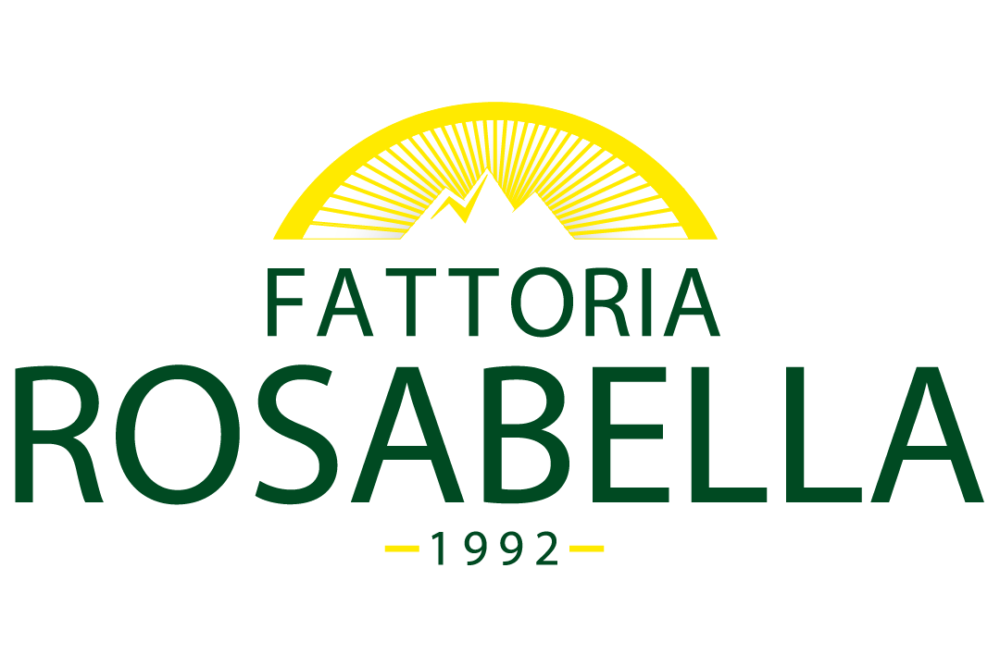

## Fattoria-ROS

Applicazione web per la gestione del bioparco Fattoria Rosabella, progetto sviluppato durante il corso di Ingegneria del Software per la laurea triennale in Informatica dell'Università degli studi di Salerno.

## Programmi utilizzati
Il sito web è stato sviluppato in linguaggio HTML, CSS e JavaScript per quano riguarda la parte di front-end, Java per la parte di back-end e SQL per la parte di persistenza dei dati. Inoltre, come IDE è stato usato Eclipse con i tools di Web Developments settati. Il sito gira su server TomCat, installato ed eseguito il locale.
